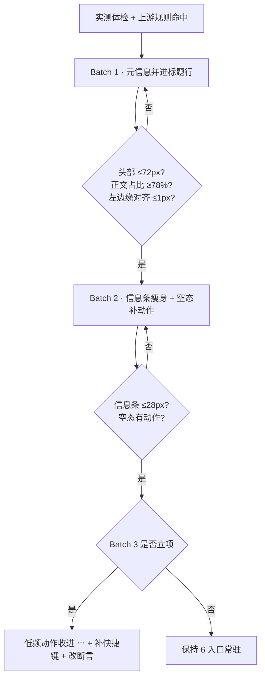

# 笔记页编辑区布局重构 · 方案 v2（上游调研版）

> **调研方式**：先补全 `ui-ux-pro-max` 上游工作流（数据 + 检索脚本），用它检索出 14 条与该任务相关的规则，再对照本仓库实测数据出方案。
> **上游安装状态**：技能目录已装 27 个文件（SKILL.md、data/*.csv、scripts/*.py 与 Node 移植版 search.mjs）。本机没有 Python 3，因此配了 `scripts/search.mjs`（移植 BM25 检索路径）；`--design-system` 未移植。
> 检索证据可用 `node <skills>/ui-ux-pro-max/scripts/search.mjs "<query>" --domain <d>` 复现。

---

## 1. 上游规则 → 对本项目的硬约束

以下 10 条是从上游数据里检索出来的命中项（每条都能用上面的命令复现），右侧是本项目要落的具体动作。

| 来源 | 规则 | 上游要点 | 本项目动作 |
| --- | --- | --- | --- |
| ux / Typography | **Line Length** | 西文 65–75 字符/行；反模式是「大屏上整宽文本」；正例 `max-w-prose` | 书写列方向被外部确证。中文 13px 字号下 65–75 字符 ≈ 30–45 字，**560px（43 字）正好落在区间内 → 维持** |
| ux / Typography | **Heading Line Balance** | 标题用 `max-inline-size` 限宽，并要求「跨宽度、跨字体、跨语言测自然换行回退」 | 标题行也进书写列；标题允许收缩但**不能硬截断** |
| ux / Typography | **Contrast Readability**（HIGH） | 深色文字配浅底；禁止灰配灰 | 头部合并后，meta 行的下拉 / 标签 / 归属仍走 `--fg-primary` / `--fg-secondary`，不得降到 `--fg-tertiary` |
| ux / Interaction | **Focus States**（HIGH） | 每个可交互控件都要可见焦点环，禁止无替代地去掉 outline | 合并进标题行后的下拉与 chip 保留 `:focus-visible` 焦点环 |
| ux / Touch | **Touch Spacing** | 相邻点击目标之间至少 8px 间距 | meta 行 gap 由 6px 提到 **8px**（对齐 `--space-2`） |
| ux / Content | **Truncation** | 长内容截断要配省略号**并提供展开途径** | 标题被压缩后，必须能读全（`title` 属性 + 输入框可横向滚动） |
| ux / Responsive | **Breakpoint Testing** | 至少在 320 / 375 / 414 / 768 / 1024 / 1440 上测 | 验收矩阵补 **1440**（此前只测 1024 / 1280 / 1600） |
| ux / Responsive | **Table Handling** | 宽表用横向滚动容器包裹，别让表撑破布局 | 链接表格与 Excel 网格在窄列下必须横向滚动（`.editor__link` 已有 `overflow: auto`，Excel 网格待确认） |
| ux / Feedback | **Empty States** | 空态要给「说明 + 动作」，不能只留白 | 编辑区空态补一个「新建笔记」动作，现在只有一句提示 |
| product | **Productivity Tool** | 主风格 Flat Design + Micro-interactions；次风格 Minimalism & Swiss；配色要「清晰层级 + 功能性色」 | 视觉方向不变：继续扁平、不加装饰，重构只动结构 |

---

## 2. 本地实测体检（1280 × 820，编辑区 734 × 674）

| 区域 | 高度 | 占编辑区 | 说明 |
| --- | --- | --- | --- |
| 标题行 | 32px | 4.7% | 标题 + 「未保存」状态 |
| 工具行 | 32px | 4.7% | 预览 · AI 整理 · 链接 · 引用 · 模板 · 全屏（固有宽 484px） |
| 元信息行 | 32px | 4.7% | 格式下拉 · 标签胶囊 · 归属 chip |
| 正文 | 496px | 73.6% | 书写列 560px ≈ 43 个中文字/行 |
| 信息条（收起） | 34px | 5.0% | 属性 N · 反链 N · 引用 N · 归属 N |

---

## 3. 问题清单

**P1 · 头部三行 104px（15.4%）是最大的可回收预算。** 三行里只有标题行承载「这一篇是什么」。

**P2 · 同一语义被拆到两行（本轮的直接动因）。** 第二轮已把格式下拉从工具行搬进元信息行，理由是「它回答的是这一篇是什么」；但标签与归属同样回答这个问题，标题却被留在上一行。

**P3 · 工具行 6 个入口常驻，但多数低频。** 上游 `ux/Feedback` 与 `ux/Content` 都强调「需要时才展开」，但工具行的取舍同时受 `ux/Interaction`（发现性）约束 —— 这是取舍，不是缺陷。

**P4 · 信息区的形态从未被正面设计过。** 默认收起 + 展开并排 / 窄窗抽屉，都是技术倒推的结果。

**P5 · 空态只有一个句子。** 违反上游 `Empty States`「消息 + 动作」。

**P6 · 断点覆盖不足。** 上游要求 1440 档，我们从未测过。

---

## 4. 三个候选形态

### 现状

```text
┌─ 编辑区 734 ─────────────────────────────────┐
│ 标题行  排版验证                      32px   │
│ 工具行  预览 整理 链接 引用 模板 全屏  32px   │
│ 元信息  Markdown▾  标签×2  归属        32px   │
│ ┌────── 书写列 560（居中）──────┐             │
│ │ 正文…                          │             │
│ └────────────────────────────────┘             │
└───────────────────────────────────────────────┘
   信息条  属性·反链·引用·归属            34px
   头部合计 104px ≈ 编辑区高度 15.4%
```

### 候选 A · 元信息并进标题行（头部 104 → 72px）

```text
┌─ 编辑区 734 ─────────────────────────────────┐
│ 标题行  排版验证…  Markdown▾ 标签×2 归属 40px │
│ 工具行  预览 整理 链接 引用 模板 全屏  32px   │
│ ┌────── 书写列 560（居中）──────┐             │
│ │ 正文…                          │             │
│ └────────────────────────────────┘             │
└───────────────────────────────────────────────┘
   信息条（Batch 2 收到 28px）
   头部 72px（-32px），正文占比 73.6% → 78.3%
```

- **收益**：正文 +32px；头部剩「身份行 + 动作行」两层，语义不再错位；完全落在上游 `Line Length` / `Heading Line Balance` 的框架内。
- **代价**：标题行可用宽度被压缩（560px 列里，下拉约 110 + 归属约 80 + 两个标签约 100 之后，标题剩约 240px ≈ 18 个中文字）。
- **必须同时满足的上游约束**：标题收缩要配「展开途径」（Truncation）；meta 行 gap 提到 8px（Touch Spacing）；所有新可聚焦控件保留焦点环（Focus States）。

### 候选 B · 工具行化为浮动条（头部 104 → 40px）

```text
┌─ 编辑区 734 ─────────────────────────────────┐
│ 标题行  排版验证…  Markdown▾ 标签 归属  40px  │
│ ┌────── 书写列 560（居中）──────┐             │
│ │ 正文…    ← 悬停 / 聚焦时浮出工具条           │
│ └────────────────────────────────┘             │
└───────────────────────────────────────────────┘
   头部 40px，正文占比约 83%
```

- **收益**：正文 +64px。
- **代价**：6 个入口从「一次点击可达」变成「先唤起再点」。上游 `Focus States`（HIGH）与 `Empty States`（要求给出动作）都把「可见、可达」放在高优先级；这 6 个动作没有约定俗成的快捷键，要补 6 组快捷键才兜得住。
- **判断**：收益 +32px 换 6 个入口的可发现性，不划算。A 落地后若仍嫌头部重，再单独评估。

### 候选 C · 只调密度（头部 104 → 96px）

- 改动量与收益（+1.2%）不成比例，且要引入一组不跟 `--control-h` 走的新数字，违反既有「控件高度只有一个真相」的约定。**不推荐。**

### 横向：书写列要放宽吗？

| 列宽 | 每行中文字 | 上游 65–75 字符区间（13px 换算） | 工具行 484px |
| --- | --- | --- | --- |
| **560px** | 43 | 落在区间内（30–45 字） | 不折叠 |
| 620px | 47 | 超出上限 | 不折叠 |
| 640px | 49 | 超出上限 | 不折叠 |

结论：**维持 560**。放宽只是为了迁就工具宽度，会把行宽推出上游给的可读区间。

---

## 5. 推荐：A 分三批，B 待观察



选 A 的理由：修的是语义错位（P2）而不是像素；复用 `Toolbar.titleNode`，不引入浮层与新组件；每一项验收都能在截图或 CDP 里量出来。

---

## 6. 分批施工单

### Batch 1 · 元信息并进标题行（核心）

- 改动：`NotesPage.tsx` 把格式下拉 / 标签 / 归属并入 `titleNode`，撤掉 `.sheet__meta`；`notes.css` 同步书写列成员、meta 行 gap 6 → 8px（Touch Spacing）。
- 验收：头部 ≤ 72px；正文占比 ≥ 78%；标题 / 工具行 / 正文左边缘 ≤ 1px；1024 下不横向滚动、不变成三行；标题始终能读全（`title` + 可滚动）。

### Batch 2 · 信息条瘦身 + 空态净化

- 收起态 34 → 28px（走 `--control-h-sm` 派生）；值为 0 的分组不显示；空态从「一句话」改成「一句话 + 新建笔记按钮」（Empty States）。

### Batch 3（可选，需单独立项）· 低频动作收进「⋯」

- 常驻只留「预览 / 链接」，其余进「⋯」并补快捷键。**注意**：这会推翻上一轮「1280 窗口下工具行不折叠」的断言，要改必须先确认。

---

## 7. 验收矩阵

| 测量项 | 现状 | 目标 | 证据 |
| --- | --- | --- | --- |
| 头部高度 | 104px | ≤ 72px | CDP 量 `.tb` 与新头部节点 |
| 正文区高度占比 | 73.6% | ≥ 78% | `notesheetcheck` 比值断言 |
| 左边缘对齐误差 | 0px | ≤ 1px | `notesheetcheck` 现有断言 |
| 书写列宽 | 560px | 560px（不变） | 同上 |
| meta 行点击目标间距 | 6px | ≥ 8px | CDP 量相邻控件间距 |
| 断点覆盖 | 1024 / 1280 / 1600 | 加 **1440** | 截图矩阵 |
| 信息条高度 | 34px | ≤ 28px | CDP 量 `.links__bar` |
| 空态动作 | 无 | 有「新建笔记」 | `notesheetcheck` 新增断言 |

---

## 8. 红线（不可破坏）

1. 上游 HIGH 项：焦点环不可删、对比度（正文 4.5:1 / 辅助 4.0:1）。
2. 交互行为：Ctrl+F 查找条、Ctrl+S 立即保存、切换笔记前 flush 防抖、Esc 退出全屏、800ms 自动保存。
3. 数据路径：关窗落盘、版本快照、AI 整理写回。
4. 设置跟随：新高度必须由 `--control-h` / `--row-h` 派生。
5. 允许改写的断言（仅这 3 条）：元信息行相关的书写列成员校验、「收起态只占一行」的高度上限、（若走 Batch 3）「工具行不折叠」。

---

## 9. 待拍板

1. 头部走 A（两行 72px）还是 B（一行 40px + 浮动工具条）？**推荐 A**。
2. 书写列维持 560？（上游区间支持维持）**推荐维持**。
3. 信息区要不要在大屏（≥1400px）改右侧常驻栏？**倾向不改**：1280 下侧栏会把书写列压到约 440，属于大屏专属形态，优先级低于 A。
